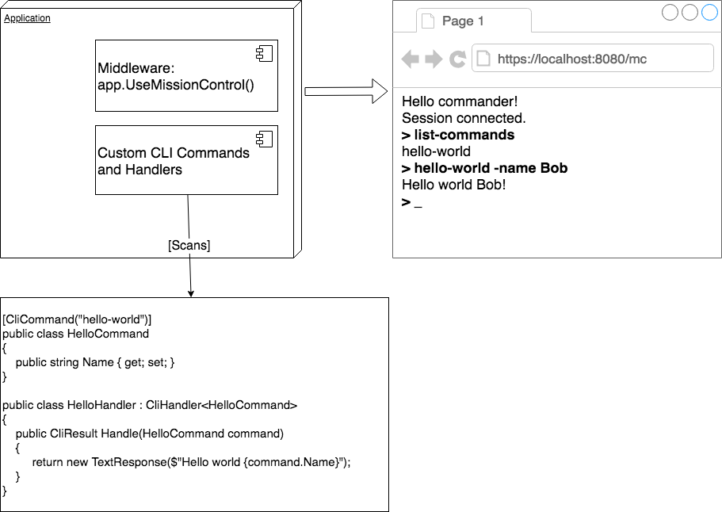

# MissionControl

[](https://www.nuget.org/packages/missioncontrol/)

CLI as a middleware for your web apps and microservices

**UNDER DEVELOPMENT - alpha version**

# Why

Often we want to add some kind of interaction with our application. For example: 

- check some background tasks
- state of objects or queues
- resources consumption
- add new user to database, update database records 
- etc

MissionControl serves CLI web terminal on a dedicated URL and executes custom commands created by application developer. There are some generic commands already bundled with this library, like *list-commands*, help and diagnostics. Custom commands are easy to add by just implementing an interface or adding an attribute, and MissonControl will handle the rest. 

# How it works

  

- just a middleware for any .NET Core app
- serves CLI UI interface on dedicated URL (/mc by default)
- automatically registers all commands/handlers in the app

## Installation and configuration

In Startup.cs register services and add a middleware:

```csharp
public void ConfigureServices(IServiceCollection services)
{
    // registers internal dependencies, scans this assemly for commands
    services.AddMissionControl();
}

public void Configure(IApplicationBuilder app)
{
    // registers /mc endpoint
    app.UseMissingControl();
}

```

With custom configuration:  
- all assemblies that contains commands and command handlers
- Url where CLI is served
- authentication callback - add your own request authentication to prevent execution of commands in production


```csharp
public void ConfigureServices(IServiceCollection services)
{
    // assemblies where commands and handlers are located
    services.AddMissionControl(typeof(PurgeCacheCommand).Assembly, typeof(ListActiveUsersCommand).Assembly);
}

public void Configure(IApplicationBuilder app)
{
    app.UseMissingControl(opt =>
    {
        opt.Url = "/mc";
        opt.Authentication = req => true; // this allows all requests, but add authentication for production deployments! 
    });
}
```

Simple command and handler example: 

```csharp
[CliCommand("say-hi", "Say Hi!")]
public class SayHiCommand : CliCommand
{
    public string Name { get; set; }

    [CliArg(required: false, help: "Attribute is optional")]
    public int Foo { get;set; }
}

public class SayHiHandler: ICliCommandHandler<SayHiCommand>
{
    // IService is resolved with standard asp.net ioc
    public SayHiHandler(IService service) { }

    public async Task<CliResponse> Handle(SayHiCommand command)
    {
        await DoSomeAsyncWork();
        return new TextResponse($"Computer says hi to {command.Name}!");
    }
}

```

Invoked in CLI console with:

```
> say-hi -name=Hackerman
Computer says hi to Hackerman!
> _
```

## Included commands

Standard commands bundled with MC:

- list-commands: displayes a list of registered commands

TODO: system diagnostics commands

every command can be invoked with **-help** argument. Handler will not be executed, but list of command arguments and its descriptions will be displayed in the console. 

## Technologies

.NET Standard 2.0 / Core 2.0   
Typescript

## Nuget

https://www.nuget.org/packages/MissionControl

[Release Notes](https://github.com/hudo/MissionControl/blob/master/RELEASE-NOTES.md)

## Contributors

[Ivana Dukic](https://github.com/idukic)  

Thanks [David Guerin](https://github.com/dguerin) for name idea!  

# State of development

- [x] basic data structure and model of DTO commands and handlers
- [x] ASP.NET Core middleware (custom URL and auth callback) 
- [x] Basic routing of web requests to internal action
- [x] Route: default HTML 
- [x] Route: static content
- [x] Route: CLI requests
- [x] Command/handlers scanning
- [x] Invoke of requested commnad handler
- [x] Handler pre/post pipeline behavior
- [x] Args: help (done), skip (done), required (done)
- [ ] UI CSS standards
- [ ] JS: UI layout and structure
- [x] JS: input parsing
- [ ] JS: ajax proxy
- [ ] JS: response rendering (text, warnings, errors)
- [ ] JS: get previous command (history)
- [ ] JS: unit tests
- [ ] control specific service instance in a cluster (epic)
- [ ] workflows/sagas/muliple response objects (epic)
- [ ] Refactor: argument parser (implement tokenizer)
- [ ] Refactor: better command/handler contracts for easier/streamlined development
- [x] Included commands: ping, list-commands, command help
- [ ] DevOps: build, test and deployment pipeline
- [ ] DevOps: automatic nuget release
- [ ] DevOps: sample site deployment pipeline